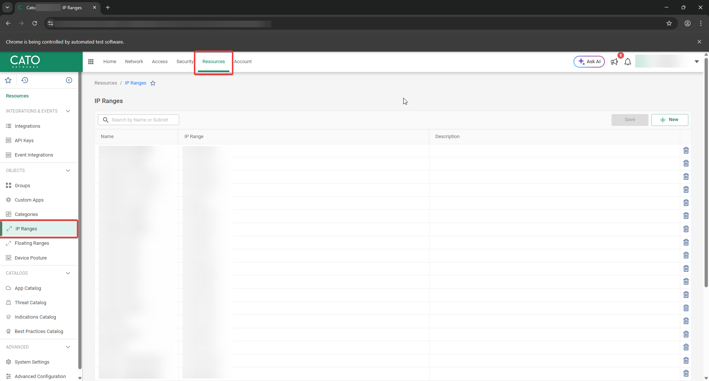
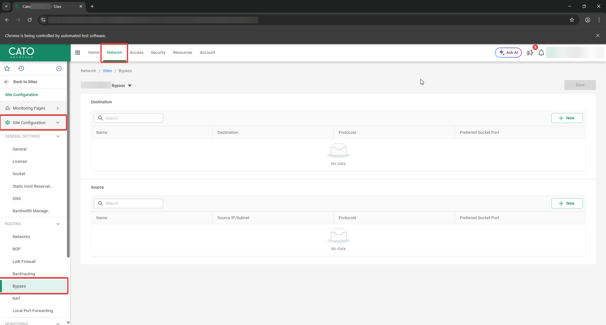
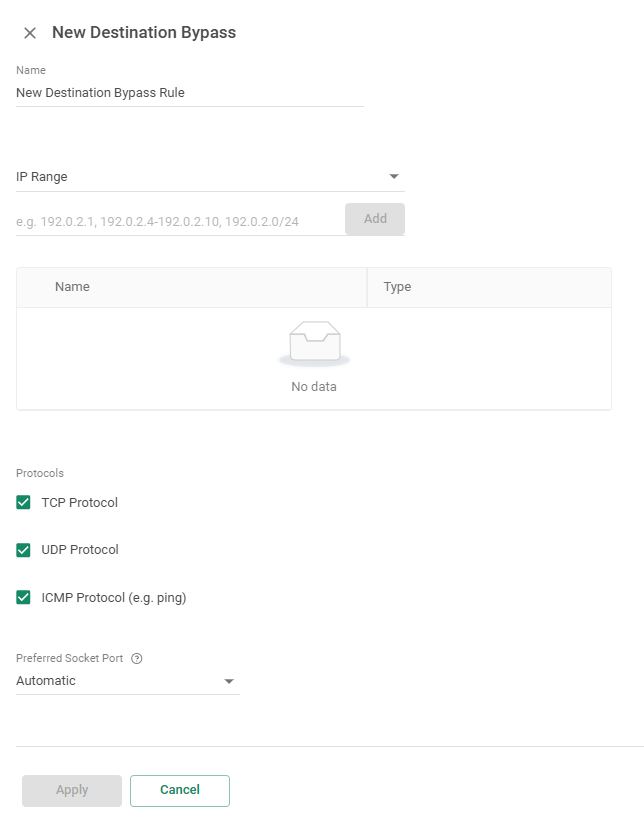

# Cato CMA Tools
Small set of simple tools to assist in tasks that currently have no official API support.

## IP Range Configuration
Load a CSV file formatted like `name,ip` and creates IP Ranges (Resources > IP Ranges) for each row.  

### How to use
Launch the script and a Selenium-controlled chrome page will open.  
Login to Cato CMA with your credentials and navigate the end customer (for MSPs).  
Navigate to the Resources > IP Ranges page:

Now press Enter on the command line and the script will ask you to open a csv file as input.  
After select the file the script will create a new IP Range object for each row in the csv file.  
After it finished, press Save on the CMA page, then press Enter again on the command line to end the script.  

## Site Bypass Configuration
Load a TXT file with a list of subnet/IP and add them as bypass destination or sources in a Bypass rule.  

### How to use
Launch the script and a Selenium-controlled chrome page will open.  
Login to Cato CMA with your credentials and navigate the end customer (for MSPs).  
Navigate to the Network > Sites > Bypass for the site you want to work on:

Now press enter on the command line and the script will present you a menu with only two options, press 1 to load ip list from file.  
Once the IP list is loaded from file the menu will show a second option to insert the loaded data as well as the number of loaded entries, please verify that the number is correct.  
Now on the CMA click on New to create a new Source or Destination rule, insert a name for the rule and select "IP Range" for the drop-down list as well as selecting the other options you need (protocols and preferred socket port).

Once ready press 2 on the command line, the script will start to insert the loaded data to the value field and press add.  
At the end the script will ask you to verify the data and press apply, then you can save the configuration on the CMA page.  
The script will go back to the menu and will give you the option to load a new list from file or to insert the loaded data again (this is useful to create the same bypass rules on multiple sites).  
